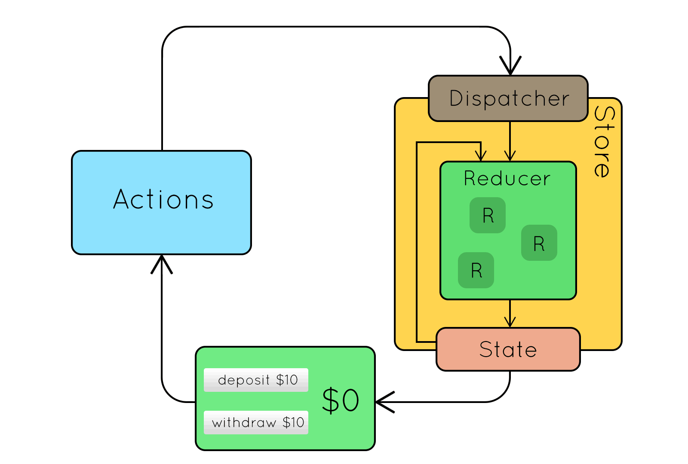

# Redux Tutorial

## What is Redux?
Redux is a predictable state container for JS app.

## Why should we use it?
When create single page apps, we will have to manage state to pass to each screen back and forth. This type of passing state back and forth will become very hard to manage.

With redux, all state is fit inside a store. Whenever we one to extract state, we can simply extract or update directly to redux store. Hence, we can think of redux is our state management tool.

## Redux Diagram

## Redux Component

